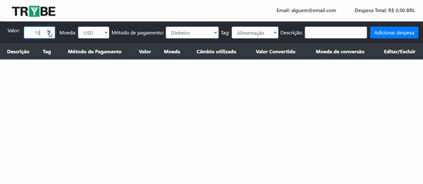

## Projeto Trybe Wallet!

### Habilidades

  * Criar um store Redux em aplicações React

  * Criar reducers no Redux em aplicações React

  * Criar actions no Redux em aplicações React

  * Criar dispatchers no Redux em aplicações React

  * Conectar Redux aos componentes React

  * Criar actions assíncronas na sua aplicação React que faz uso de Redux.

---

Neste projeto eu desenvolvi uma carteira de controle de gastos com conversor de moedas, ao utilizar essa aplicação um usuário deverá ser capaz de:
  - Adicionar, remover e editar um gasto;
  - Visualizar uma tabelas com seus gastos;
  - Visualizar o total de gastos convertidos para uma moeda de escolha;

---

### Requisitos do projeto

#### 1. Crie uma página inicial de login com os seguintes campos e características:

 

#### 2. Realize as seguintes verificações nos campos de email, senha e botão:

#### 3. Utilize o Redux para salvar no estado global as informações da pessoa logada

#### 4. Crie uma página para sua carteira com as seguintes características:

  

#### 5. Crie um header para a página de carteira contendo as seguintes características:

#### 6. Desenvolva um formulário para adicionar uma despesa contendo as seguintes características:

#### 7. Implemente a lógica para preencher as opções do campo "Moedas", buscando as siglas das moedas da API:

#### 8. Desenvolva a opção de "Adicionar despesa" na sua tabela de gastos

#### 9. Desenvolva uma tabela com os gastos contendo as seguintes características:

#### 10. Crie um botão para deletar uma despesa da tabela contendo as seguintes características:

 

#### 11. Crie um botão para editar uma despesa da tabela contendo as seguintes características:

 
